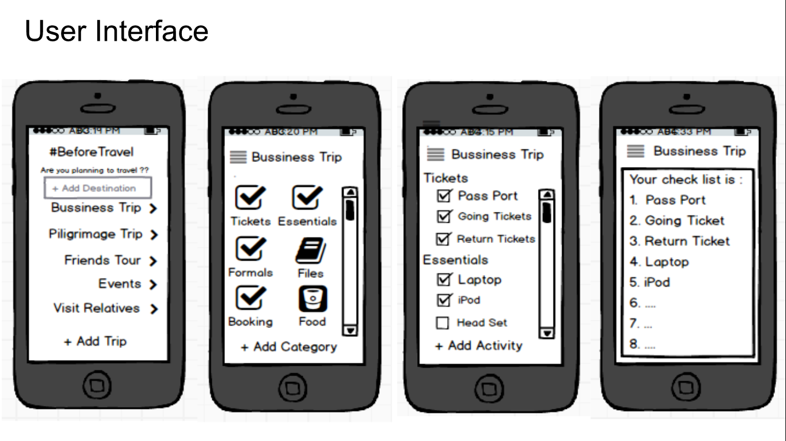

# #BeforeTravel
   Sometimes, We may forget the necessaries needed for the trip when we are in travel and felt regret on it and same thing is happened me. So, I made a technological sol'n ‘BeforeTravel’ which is an iOS mobile app solution that recommended the necessaries related to user specified trip like bussiness trip, piligrimage trip, friends tour, events or visiting relatives.
   This work is done on the part of mini project in the course **Programming Systems**.
   
 
**Following is the wireframe images of my app and same like I developed**.

  

